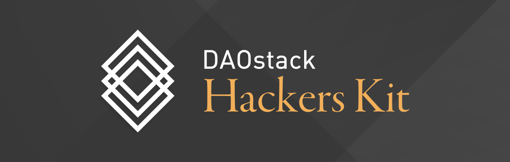

# Introduction

The idea for the Gen Community Dapp came about from the DAOstack hackathon. 

Our goal is to create a decentralized governance system which allow DAOs, such as the Bush Generator, to empower their employees and community members to make decisions on a shared green space. Our platform would consist of several mechanisms:

 **Proposal/ Voting Mechanism**: 
 - Members of a DAO will be given the ability to make proposals on certain initiatives for the green space. In our example, members can choose between three initiatives set by Bushwick Generator: Music, Food, and Charity. Within the Music initiative, members may vote on the artist playing for the party. 
 - The goal of the proposals is to increase community engagement by selecting local artists to play at the event or have local restaurants cater food for Fridays.
 - The Dapp currently has a simple majority voting mechanism but we envision it incorporating the DAOstack holographic consensus with a betting mechanism for proposals. This will allow for proposal to be "boosted" and only require a relative majority
 - The results of a given vote will impact a member's reputation based on their position and the magnitude of a given initiative. The magnitude of an initiative may be determined by the money involved with each proposal
 - The change in reputation will also be impacted by the magnitude of the proposal

 **Attestation Mechanism**:
 - Once a given proposal is completed, the members of an organization will attest to the truthiness of the proposal. 
 - Once a proposal has received a sufficient amount of attestations, then the proposal will have been deemed completed
 - The amount of the attestations needed for a given proposal still needs to be determined

**Central Treasury Mechanism**: 
- Once the proposal has been deemed completed, then the Central Treasury of the DAO will pay out the recipient of the proposal. In our example, this would be the artist performing at the party.
- At proposal generation, the recipient's wallet will be needed in order to facilitate the payment. 

## Getting Started

### Prerequisites

- Use a browser with metamask.

### Installing

```
$ git clone git@github.com:fodisi/dao-hackathon.git
$ npm install
$ npm start
```